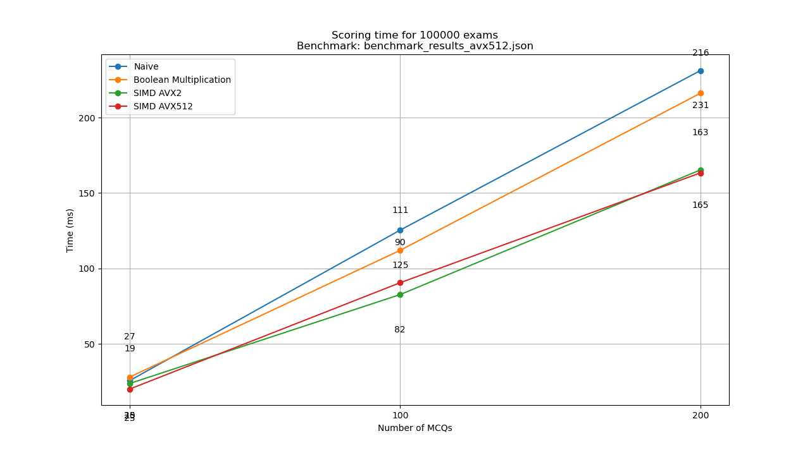
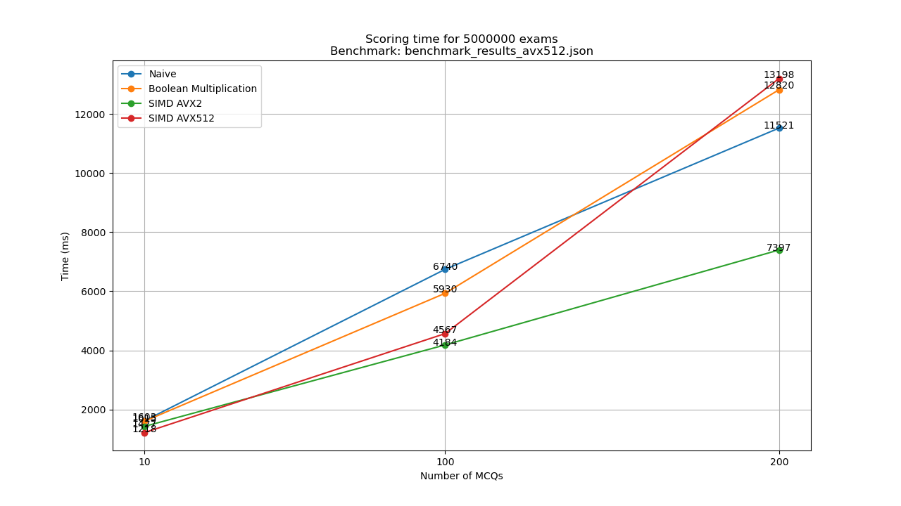
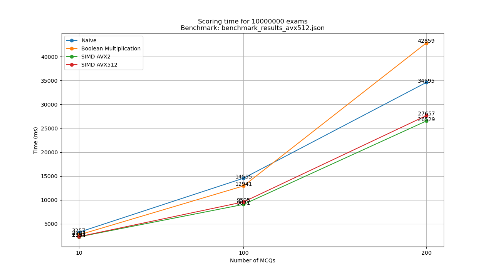
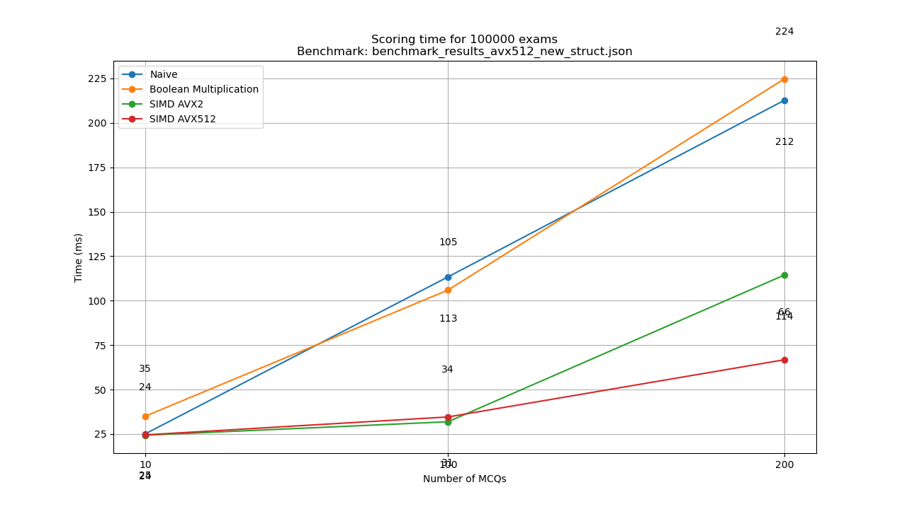
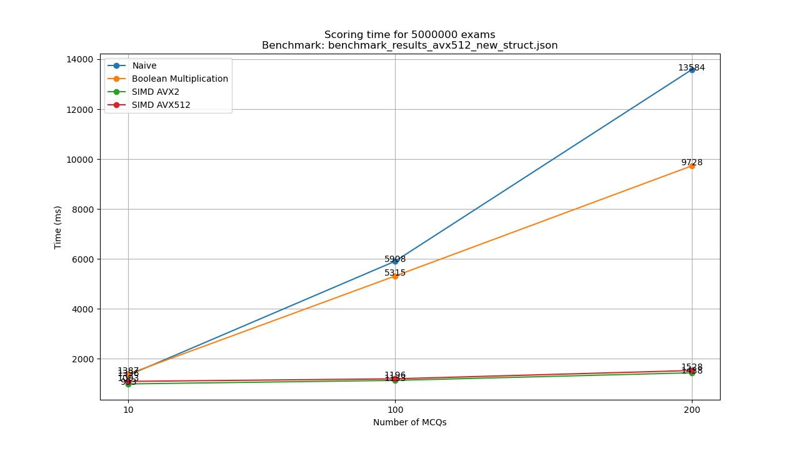
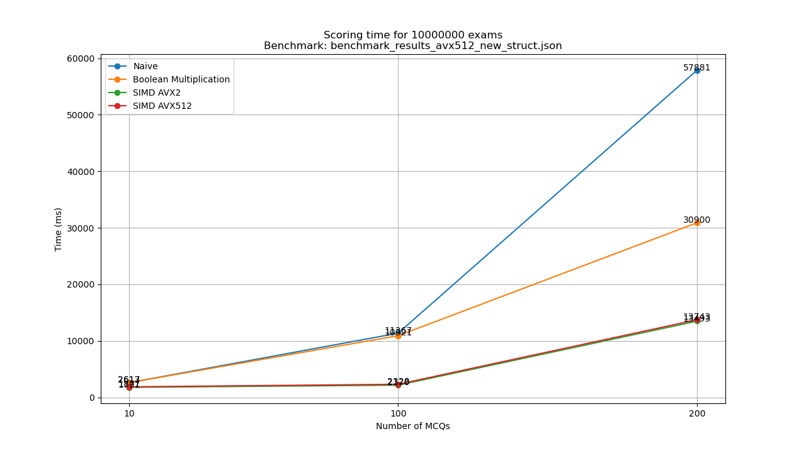

# simd-research

This repository contains code of my SIMD experiment.

## Requirements

- CMake (>= 3.20)
- GCC (>=10.0, with C++20 support)
- vcpkg
- pkg-config
- An x86_64 CPU with at least AVX512 support.

> [!NOTE]
> There is an older version (using std::vector) on the branch `avx512_vec`, and the benchmark results are inside the
> file `benchmark/benchmark_results_avx512.json`

## Run

```shell
cmake --preset=default
cmake --build build

# Test
./build/main_test

# Benchmark
mkdir -p benchmark
./build/main_benchmark --benchmark_format=json --benchmark_out=benchmark/benchmark_results.json

# Benchmark graphs (will be generated in ./graphs)
mkdir -p graphs
python3 ./utils/benchmark_graphs.py benchmark/
```

## Results
### Benchmark system
> [!NOTE]
> This is a VM that I borrowed from my friend, special thanks to [@bmin-mit](https://github.com/bmin-mit).
- Ubuntu 24.04.2 LTS x86_64 6.8.0-60-generic
- 11th Gen Intel i5-1135G7 (2 or 4) @ 2.419GHz
- 4 GB RAM
### Graphs
#### std::vector as exams' data structure



#### Custom data structure (inside `include/exam.h`)




## Reference

- https://www.pcg-random.org/ (used in the random exam generator)
- [Intel Intrinsics Guide](https://www.intel.com/content/www/us/en/docs/intrinsics-guide/index.html)

## License
MIT License
Please note that this license applies to ALL branches of this repository as stated in the [LICENSE](./LICENSE) file.
